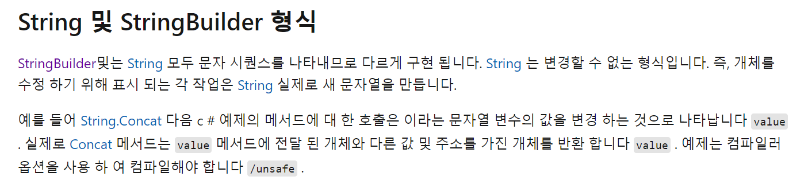

## 3단계 - for문

### 2739번 문제 - 구구단

```markdown
/// <summary>
    /// 2739번 문제
    /// </summary>
    internal class Question2739
    {
        public static void Main(string[] args)
        {
            var input = Console.ReadLine();

            //콘솔 입력값이 있는 지 확인
            if(input!=null)
            {
                //정수 변환 검사
                if(int.TryParse(input, out int N))
                {
                    //N은 1보다 크거나 같고 9보다 작거나 같다.
                    if(N >=1 && N<=9)
                    {
                        for(int i=1; i<=9; i++)
                        {
                            Console.WriteLine(string.Format("{0} * {1} = {2}", N, i, N * i));
                        }
                    }
                    else
                    {
                        Console.WriteLine("N이 1보다 작거나 9보다 크다");
                    }
                }
                else
                {
                    Console.WriteLine("입력된 값이 정수값이 아닙니다.");
                }
            }
            else
            {
                Console.WriteLine("입력값이 null");
            }
        }
    }
```

- for문 기준 가장 간단한 문제
- 구구단을 작성하는 것, 조건은 N은 1보다 크거나 같고 9보다 작거나 같다.
- 입력받은 N을 9단까지 출력
- 한 번에 맞춤

### 10950번 문제 - A+B 합 for문

```markdown
using System;

namespace Baekjoon
{
    internal class Question10950
    {
        public static void Main(string[] args)
        {
            //입력값 
            var input = Console.ReadLine();

            if(input!=null)
            {
                //int 변환 검사
                if(int.TryParse(input, out int count))
                {
                    //A+B 합 배열
                    int[] sumArray = new int[count];

                    //개수만큼 for문을 돌면서 A,B값을 구하고 더한다.
                    for (int i=0; i<count; i++)
                    {
                        var inputAB = Console.ReadLine();
                        if(inputAB!=null)
                        {
                            var splitInputAB = inputAB.Split(' ');
                            if(splitInputAB!=null && splitInputAB.Length==2)
                            {
                                if((int.TryParse(splitInputAB[0], out int A) && int.TryParse(splitInputAB[1],
                                    out int B)))
                                {
                                    sumArray[i] = A + B;
                                }
                            }
                        }
                    }

                    //합 결과 배열을 출력
                    for(int i=0; i<count; i++)
                    {
                        Console.WriteLine(sumArray[i]);
                    }
                }
            }
        }
    }
}
```

- 기존 사칙연산 문제에서 for문을 접목한 문제
- 처음 입력한 값이 for문을 도는 개수
- 그 후 입력 값은 A와 B 값으로 입력됨
- 최종적으로 입력된 값은 for문을 돌면서 출력됨
- 한 번에 맞춤


### 8393번 문제 - 합

```
using System;

namespace Baekjoon
{
    internal class Question8393
    {
        public static void Main(string[] args)
        {
            //입력값 
            var input = Console.ReadLine();

            if(input!=null)
            {
                //int 변환 검사
                if(int.TryParse(input, out int num))
                {
                    //총 합
                    var total = 0;

                    //for문 돌면서 더한다.
                    for(int i=1; i<=num; i++)
                    {
                        total += i;
                    }

                    //출력값
                    Console.WriteLine(total);
                }
            }
        }
    }
}
```

* 입력된 값을 활용하여 for문을 돌면서 합을 구하는 문제
* 간단한 문제라 맞춤


### 15552번 문제 - 빠른 A+B

```markdown
using System;
using System.Text;

namespace Baekjoon
{
    internal class Question15552
    {
        public static void Main(string[] args)
        {
            //입력값 
            var inputNum = Console.ReadLine();
            var sb = new StringBuilder();

            if (inputNum != null)
            {
                //int 변환 검사
                if (int.TryParse(inputNum, out int num))
                {
                    //최대값은 1,000,000
                    if (num <= 1000000)
                    {
                        //StringBuilder로 문자열을 추가한다.
                        for (int i = 0; i < num; i++)
                        {
                            var result = Console.ReadLine().Split(' ');

                            if(int.TryParse(result[0], out int A) && int.TryParse(result[1], out int B))
                            {
                                sb.Append(A + B);
                                sb.Append("\n");
                            }
                        }

                        Console.WriteLine(sb);
                    }
                }
            }
        }
    }
}
```

* 기존 A+B의 합을 구하는 방식에서 실행속도가 빨라야한다.
* 처음에는 Split() 함수가 느렸다고 생각해 자르지 않고 할 수 있는 방법을 찾아봤는데 시간초과가 생각보다 맞추기 어려웠다.
* Microsoft Docs에서 String 관련된 내용을  확인하면 String을 수정하게 되면 새로운 문자열을 만들기 때문에 속도가 느린 것이었다.




* 따라서 StringBuilder를 통해 값을 합치는 방식을 사용하여 새 문자열을 생성하지 않도록 작성하였다.
* 그 후 제출하여 무사히 통과하였다.